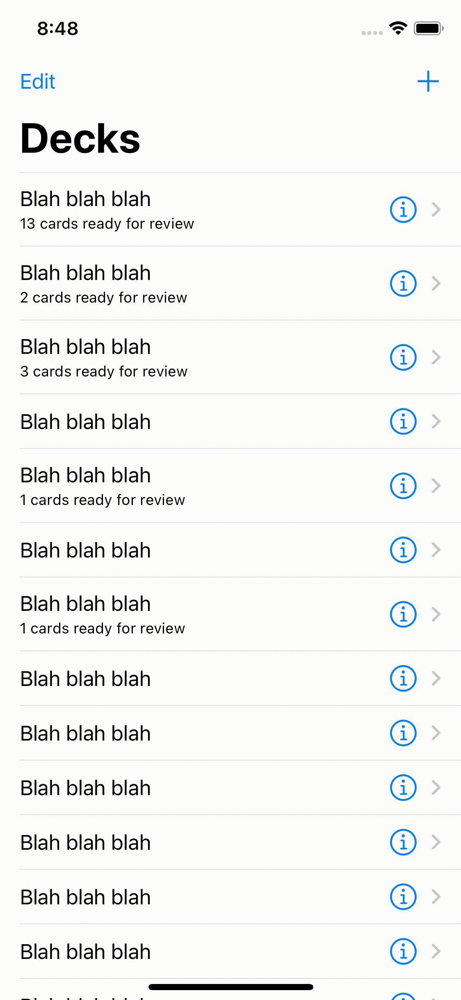

# Spreppy

Spreppy ("spaced repetition") is an in-development iOS app for spaced repetition memorization, akin to [Anki](https://apps.ankiweb.net).



## Developer Setup

Download the latest Xcode, clone this repo, and run `make open`:

```bash
git clone git@github.com:rwblickhan/Spreppy.git
cd Spreppy
make open
```
